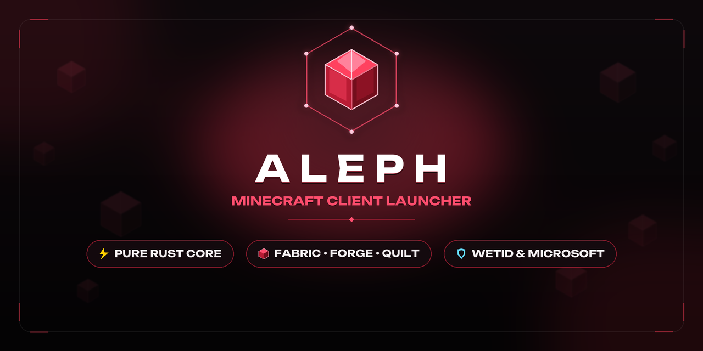

<p align="center">
  
</p>

# ℵ Aleph Minecraft Client Launcher (AMC Launcher)

<div align="center">

**Высокопроизводительный, модульный и открытый лаунчер Minecraft нового поколения на чистом Rust.**

[](https://www.rust-lang.org/)
[](LICENSE)
[](https://github.com/KurumaOfficial/Aleph-Minecraft-Client-Launcher)

[English](README.md) • [Русский](README.ru.md)

[О проекте](#-о-проекте) • [Возможности](#-возможности) • [Архитектура](#-архитектура-workspace) • [Сборка](#-сборка-из-исходников) • [Дорожная карта](#-дорожная-карта)

---

</div>

## 📌 О проекте

Большинство популярных лаунчеров сегодня либо упакованы в тяжелый Electron и потребляют по гигабайту оперативной памяти в фоне, либо перегружены навязчивой рекламой и закрытым кодом.

**AMC Launcher** создается с нуля как бескомпромиссная альтернатива:
- **Мгновенный старт:** запуск интерфейса за ~300 мс и ультранизкое потребление ресурсов (~30 МБ ОЗУ).
- **Чистый Rust:** модульная архитектура Cargo Workspace на 6 независимых библиотеках.
- **Никакой телеметрии и скрытых сервисов:** прямой обмен данными только с Mojang API, Adoptium, Modrinth и CurseForge.
- **Строгий дизайн Aleph Studio:** темная рубиновая палитра (`#080606`, `#8B1A2A`), безрамное окно с нативным поведением и высокая частота кадров интерфейса (60–144+ FPS).

---

## ⚡ Возможности

### 🎮 Запуск и мультизагрузчики
- **Поддержка любых версий Minecraft:** от новейших релизов (1.21+) и снапшотов до классических Alpha и Beta.
- **Все популярные загрузчики модов:** Fabric, Quilt, Minecraft Forge, NeoForge, OptiFine и чистая Vanilla.
- **Автоматическая установка Java:** лаунчер сам определяет необходимую версию OpenJDK (8, 17, 21) под выбранную версию игры, загружает ее через официальный Adoptium API и распаковывает в изолированную папку `runtimes/`. Вручную настраивать `JAVA_HOME` не требуется.
- **Многопоточный загрузчик (16 потоков):** параллельная загрузка Client JAR, библиотек и ассетов с контролем целостности SHA-1. Повторный запуск уже загруженной версии происходит мгновенно (~100 мс).

### 🧩 Сборки и изоляция (Instances)
- **Изолированные директории:** у каждой созданной сборки своя папка с отдельными модами, конфигами, ресурспаками и мирами.
- **Быстрое редактирование:** изменение версии игры, загрузчика, названия и выделения оперативной памяти прямо в карточке сборки.
- **Учет игрового времени:** отслеживание времени проведенного в игре по каждой сборке и даты последней сессии.
- **Быстрый доступ:** открытие папки сборки в Проводнике Windows в один клик.

### 🌐 Менеджер модов
- **Мульти-провайдерный поиск:** каталог модов с одновременным поиском через **Modrinth API v2** и **CurseForge (CurseTools API)**.
- **Установка в 1 клик:** прямая загрузка `.jar` файлов сразу в папку `mods/` активной сборки.
- **Управление локальными модами:** просмотр установленных модов с парсингом манифестов (`fabric.mod.json`, `mods.toml`), включение и отключение модов без их удаления (через расширение `.disabled`).

### 👤 Скины и персонализация
- **2D Skin Viewer:** предпросмотр скина со всеми слоями одежды (голова, шлем, тело, куртка, руки, рукава, ноги, штаны).
- **Поддержка моделей:** мгновенное переключение между Classic (4px) и Slim / Alex (3px).
- **Нативный выбор файлов:** интеграция с диалоговым окном Windows (`rfd`) для загрузки любого локального скина формата PNG.
- **Динамический аватар:** лицо персонажа автоматически нарезается из активного скина и отображается в нижнем статус-баре.

### 📟 Консоль игры и диагностика
- **Живой перехват логов:** захват потоков stdout и stderr процесса Minecraft с буфером на 5000 строк.
- **Синтаксическая подсветка:** фатальные сбои и Exception подсвечиваются рубиновым цветом, варнинги — оранжевым, отладочная информация — приглушенным серым.
- **Удобные инструменты:** живой поиск по логу, переключатель автоскролла вниз, копирование в буфер обмена и экспорт лога в текстовый файл.

### 🌐 Локализация и мультиязычность
- **Мгновенное переключение:** Переключение интерфейса между **Русским**, **English** и **Українська** прямо на лету в настройках без перезапуска лаунчера.
- **Типобезопасная архитектура:** Нулевые накладные расходы и 100% покрытие всех окон, вкладок и модальных окон благодаря типизированной системе словарей в `amc-core::i18n`.

### 🚀 Пресеты оптимизации JVM
- **Aikar's G1GC Preset:** набор проверенных аргументов виртуальной машины Java для устранения микрофризов и скачков фреймрейта при прогрузке чанков.
- **Generational ZGC Preset:** ультрабыстрый сборщик мусора с субмиллисекундными паузами для Java 17+.

---

## 🏗 Архитектура Workspace

Проект структурирован как многомодульный Cargo Workspace:

```
AMC_Launcher/
├── crates/
│   ├── amc-core/          # Типы сборок (Instance), версий, путей (LauncherPaths), конфиг
│   ├── amc-auth/          # Авторизация (Offline, Microsoft Device Code Flow, WetID)
│   ├── amc-downloader/    # Асинхронный движок загрузок, проверка SHA-1, Adoptium OpenJDK
│   ├── amc-minecraft/     # Mojang API, построение аргументов JVM, запуск процесса, SLP-пинг
│   ├── amc-mods/          # Modrinth API v2, CurseForge API, парсер локальных JAR-манифестов
│   └── amc-ui/            # GUI на eframe/egui: окна, виджеты, палитра Aleph Studio
├── assets/                # Шрифты (Segoe UI, Unbounded, JetBrains Mono) и иконки
└── src/
    └── main.rs            # Точка входа приложения, конфигурация Viewport и OpenGL
```

---

## 🛠 Сборка из исходников

### Требования
- **Rust Toolchain:** версия `1.80` или новее (рекомендуется `stable`).
- **Операционная система:** Windows 10/11 x64 (целевая платформа), Linux (X11 / Wayland).

### Инструкция

1. Клонируйте репозиторий:
```bash
git clone https://github.com/KurumaOfficial/Aleph-Minecraft-Client-Launcher.git
cd Aleph-Minecraft-Client-Launcher
```

2. Проверьте компиляцию и запустите тесты:
```bash
cargo test --workspace
```

3. Запустите в режиме разработки:
```bash
cargo run
```

4. Соберите оптимизированный релизный бинарник:
```bash
cargo build --release
```
Готовый исполняемый файл будет находиться по пути: `target/release/amc-launcher.exe`.

---

## 🗺 Дорожная карта

- [x] Полный рекод архитектуры на модульный Cargo Workspace (6 крейтов).
- [x] Поддержка автозагрузки OpenJDK 8, 17, 21 через Adoptium API.
- [x] Мультизагрузчики (Fabric, Quilt, Forge, NeoForge, OptiFine, Vanilla).
- [x] Каталог модов с интеграцией Modrinth API v2 и CurseForge.
- [x] 2D предпросмотр скина и живая генерация аватара в статус-баре.
- [x] Встроенная интерактивная консоль процесса игры с экспортом логов.
- [x] Пресеты тюнинга Garbage Collector для устранения лагов в игре.
- [x] Трехъязычная локализация (English, Русский, Українська).
- [x] Мониторинг статуса и пинга серверов Minecraft по TCP.
- [ ] 3D рендер скина персонажа.
- [ ] Экспорт и импорт модпаков в формате `.mrpack` и CurseForge `.zip`.
- [ ] Автоматическая проверка обновлений установленных модов.

---

## 📄 Лицензия

Проект распространяется под свободной лицензией **GNU General Public License v3.0 (GPL-3.0-or-later)**. Подробности смотрите в файле [LICENSE](LICENSE).
